## Quick Arr Stack

TV shows and movies download, sorted, with the desired quality and subtitles, behind a VPN (optional), ready to watch, in a beautiful media player.
All automated.

On top of the original configurations added information related to the PureVPN configurations and added a wireguard docker to access the content of the media center outside the home network without the need to open the Plex port.


_Disclaimer: I'm not encouraging/supporting piracy, this is for information only._

## Table of Contents

- [Quick Arr Stack](#quick-arr-stack)
  - [Table of Contents](#table-of-contents)
  - [Overview](#overview)
  - [Hardware configuration](#hardware-configuration)
  - [Software stack](#software-stack)
  - [Installation guide](#installation-guide)
    - [Install docker and docker-compose](#install-docker-and-docker-compose)
    - [Helpfull Docker Commands](#helpfull-docker-commands)
    - [Clone the repository](#clone-the-repository)
    - [Setup environment variables](#setup-environment-variables)
    - [Folder Setup](#folder-structure)
    - [Setup a VPN Container](#setup-a-vpn-container)
      - [VPN Option](#vpn-option)
      - [purevpn.com custom setup](#purevpncom-custom-setup)
      - [Docker container](#vpn-docker-container)
    - [Setup Deluge](#setup-deluge)
      - [Docker container](#deluge-docker-container)
      - [Configuration](#deluge-configuration)
    - [Setup Plex](#setup-plex)
      - [Docker Container](#media-server-docker-container)
      - [Configuration](#plex-configuration)
    - [Setup Sonarr](#setup-sonarr)
      - [Docker container](#sonarr-docker-container)
      - [Configuration](#sonarr-configuration)
    - [Setup Radarr](#setup-radarr)
      - [Docker container](#radarr-docker-container)
      - [Configuration](#radarr-configuration)
    - [Setup Prowlarr](#setup-prowlarr)
      - [Docker container](#prowlarr-docker-container)
      - [Configuration](#prowlarr-configuration)
    - [Setup Bazarr](#setup-bazarr)
      - [Bazarr Docker container](#bazarr-docker-container)
      - [Bazarr Configuration](#bazarr-configuration)
    - [Testing](#testing)
    - [Optional containers](#optional-containers)
      - [Setup Wireguard](#setup-wireguard)
        - [Docker container](#wireguard-docker-container)
        - [Configuration and usage](#wireguard-configuration)
      - [Setup Overseerr](#overseerr-setup)
        - [Docker container](#overseerr-docker-container)
        - [Configuration and usage](#overseerr-configuration)
      - [Setup Portainer](#portainer-setup)
        - [Docker container](#portainer-docker-container)
        - [Configuration and usage](#portainer-configuration)
  - [Mobile Management](#mobile-management)

## Overview

This is a quick guide on how to build a server with a [Servarr stack](https://wiki.servarr.com/)

How does it work?

This is composed of multiple tools working together to have an automated way to monitor and watch your favourite TV Shows and Movies

**Downloaders**:

- [OpenVPN Client](https://github.com/dperson/openvpn-client) (optional but highly recommended): the container is used by Deluge to encapsulate the incoming/outgoing traffic.
- [Deluge](http://deluge-torrent.org/) handles torrent download.
- [Prowlarr](https://prowlarr.com/): is an indexer manager/proxy built on the popular *arr .net/reactjs base stack to integrate with your various PVR apps. Prowlarr supports the management of both Torrent Trackers and Usenet Indexers.
- [Bazarr](https://www.bazarr.media/) is a companion application to Sonarr and Radarr. It manages and downloads subtitles based on your requirements. You define your preferences by TV show or movie and Bazarr takes care of everything for you.

**Download orchestration**:

- [Sonarr](https://sonarr.tv): manage TV show, automatic downloads, sort & rename
- [Radarr](https://radarr.video): basically the same as Sonarr, but for movies

**Media Center**:

- [Plex](https://plex.tv): media center server with streaming transcoding features, useful plugins and a beautiful UI. Clients available for many systems (Linux/OSX/Windows, Web, Android, Chromecast, Android TV, etc.)


**Optional**:

- [Overseerr](https://overseerr.dev/):  is a free and open source software application for managing requests for your media library. It integrates with your existing services, such as Sonarr, Radarr, and Plex!

- [Wireguard](https://github.com/linuxserver/docker-wireguard): is an extremely simple yet fast and modern VPN that utilizes state-of-the-art cryptography. This will allow us to connect to our home network  from anywhere and use the Plex app outside of our house without using Plex servers for routing.

- [Portainer](https://github.com/portainer/portainer): This is a lightweight service that allows us to monitor all of our containers, we can see the status, logs and manage them directly there.

## Hardware configuration

You can use an old Laptop with Debian, Raspberry Pi, a Synology NAS, or a Windows or Mac computer. The stack should work fine on all these systems, but you must adapt the Docker stack below to your OS. I'll only focus on a standard Linux installation here.

Keep in mind that all the movies and shows are downloaded to your computer, so a Hard Drive with high capacity is recommended.

## Software stack

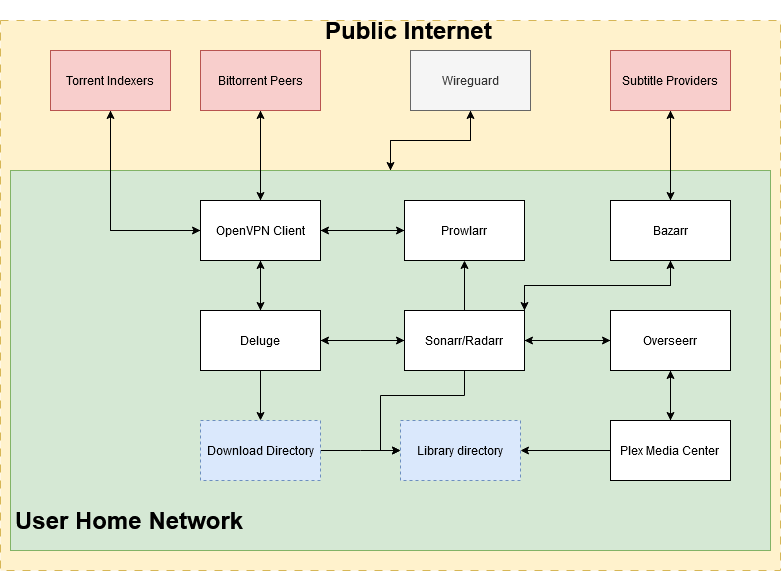

## Installation guide

### Install docker and docker-compose

See the [official instructions](https://docs.docker.com/engine/installation/linux/docker-ce/ubuntu/#install-docker-ce-1) to install Docker.

Then add yourself to the `docker` group:
`sudo usermod -aG docker myuser`

Make sure it works fine:
`docker run hello-world`

Also, install docker-compose (see the [official instructions](https://docs.docker.com/compose/install/#install-compose)).

### Helpfull Docker Commands

```sh
#Check the Status of all docker containers:
docker container ls --format "{{.Names}} || state {{.State}} {{.Status}} || ID {{.ID}}"

#Restart a specific container:
docker-compose restart CONTAINER_NAME

#To follow container logs:
docker-compose logs -f CONTAINER_NAME

#To update all containers:
docker-compose stop
docker-compose pull
docker-compose start

```


### Clone the repository

This tutorial will guide you along the full process of making your own docker-compose file and configuring every app within it, however, to prevent errors or to reduce your typing, you can also use the general-purpose docker-compose file provided in this repository.

1. First, `git clone https://github.com/Rick45/quick-arr-Stack` into a directory. This is where you will run the full setup from (note: this isn't the same as your configuration or media directory)
2. Rename the `.env.example` file included in the repo to `.env`.
3. Continue this guide, and the docker-compose file snippets you see are already ready for you to use. You'll still need to manually configure your `.env` file and other manual configurations.

### Setup environment variables

Rename the `.env.example` file included in the repo to `.env`.

Here is an example of what your `.env` file should look like, use values that fit your own setup.

```sh
# Your timezone, https://en.wikipedia.org/wiki/List_of_tz_database_time_zones
TZ=Europe/Lisbon
# UNIX PUID and PGID, find with: id $USER
PUID=1000
PGID=1000
# The directory where configuration will be stored.
ROOT=/home/{youruser}/  #update the {youruser} with your user path
# The directory where data will be stored.
HDDSTORAGE=/home/{youruser}/Storage/ #update the {youruser} with your user path

# Wireguard Settings
#Your public ip, auto for auto detect
SERVERURL=auto
#number of devices to generate configuration to connect to the wireguard vpn
PEERS=7
```

Things to notice:

- TZ is based on your [tz time zone](https://en.wikipedia.org/wiki/List_of_tz_database_time_zones).
- The PUID and PGID are your user's ids. Find them with `id $USER`.
- This file should be in the same directory as your `docker-compose.yml` file so the values can be read in.


***


#### Folder Structure

Currently, I'm doing this in this way as it is(from what I found) the most straightforward method to have the [Hard link](https://en.wikipedia.org/wiki/Hard_link) for files to work without issues, this halves the amount of size while the torrent is seeding, and solve some access issues that I found while doing this setup.


Inside the folder from where you cloned the repository run the following command:  `docker-compose up -d --remove-orphans`.

Then run the following ones:

`sudo chown -R $USER:$USER /path/to/ROOT/directory` 
 
and 
 
`sudo chown -R $USER:$USER /path/to/HDDSTORAGE/directory` 
 
This will allow you to create folders, copy and paste files, this could be also required for Sonarr and Radarr to do some operations.

After this Create 2 folders in the `Storage\Completed` folder, `Movies` and `TV`, this will be used later.


### Setup a VPN Container

#### VPN Option

If you do not own a VPN you can bypass this step.
  - Is required to comment the highlighted lines in the `docker-compose.yml`
 example:
 ```sh
    #ports:
    #  - '8112:8112' #uncomment if you are not using the VPN
    network_mode: 'service:vpn' #comment/remove if you are not using the VPN
    depends_on:                 #comment/remove if you are not using the VPN
      - vpn                     #comment/remove if you are not using the VPN
```

The goal here is to have an OpenVPN Client container running and always connected. We'll make Deluge incoming and outgoing traffic go through this OpenVPN container.

This must come up with some safety features:

Configuration is explained on the [project page](https://github.com/dperson/openvpn-client), you can follow it.
However, it is not that easy depending on your VPN server settings.
I'm using a purevpn.com VPN, so here is how I set it up.


#### purevpn.com custom setup

_Note_: this section only applies for [PureVPN](purevpn.com) accounts.

1. Delete all content in `${ROOT}/config/vpn` and replace it with the ones available in the repo folder `Config Files\config\vpn(PureVPN)`
1. Download the openVPN file from [PureVPN website](https://support.purevpn.com/openvpn-files).
1. Open the file in the udp folder related to the country/connection that you want to use.
1. Copy the remote value in the file and replace it on the vpn.conf file that is 


#### VPN Docker container

Your docker-compose file should have something like this:

```yaml

  vpn:
    container_name: vpn
    image: 'dperson/openvpn-client:latest'
    environment:
      - 'OTHER_ARGS= --mute-replay-warnings'
    cap_add:
      - net_admin
    restart: unless-stopped
    volumes:
      - '${ROOT}/MediaCenter/config/vpn:/vpn'
    security_opt:
      - 'label:disable'
    devices:
      - '/dev/net/tun:/dev/net/tun'
    ports:
      - '8112:8112' #deluge web UI Port
    command: '-f "" -r 192.168.68.0/24'

```

Then run the container with `docker-compose up -d --remove-orphans`.

To follow container logs, run `docker-compose logs -f vpn`.

every time that you do changes in the VPN config file run `docker-compose restart vpn` this will force the container to restart and load the new settings

***


### Setup Deluge


#### Deluge Docker container

_Note_: (Not Advised) If you don't own a VPN and want to use this without VPN  use the following compose, this WILL EXPOSE your real IP address.

```yaml

deluge:
    container_name: deluge
    image: 'linuxserver/deluge:latest'
    restart: unless-stopped
    environment:
      - PUID=${PUID} # default user id, defined in .env
      - PGID=${PGID} # default group id, defined in .env
      - TZ=${TZ} # timezone, defined in .env
    volumes:
      - '${ROOT}/MediaCenter/config/deluge:/config'  # config files
      - '${HDDSTORAGE}:/MediaCenterBox'  # downloads folder
    network_mode: 'service:vpn' #comment/remove if you are not using the VPN
    depends_on:                 #comment/remove if you are not using the VPN
      - vpn                     # run on the vpn network #comment/remove if you are not using the VPN

```


#### Deluge Configuration

_Note_: If the bellow page does not open and you are using the VPN normally it means that something is wrong with the VPN itself!

run `docker-compose restart deluge` everytime that you stop or start te VPN container as deluge dependes on it.


You should be able to log in on the web UI (`localhost:8112`, replace `localhost` with your machine ip if needed).


The default password is `deluge`. You are asked to modify it.

The running deluge daemon should be automatically detected and appear online, you can connect to it.


You should activate `autoadd` in the plugins section: it adds support for `.magnet` files.


You should activate `Label` in the plugins section: it adds support for labels in Sonarr and Radarr

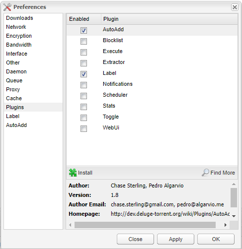


Configuration gets stored automatically in your mounted volume (`${ROOT}/config/deluge`) to be re-used at container restart. Important files in there:

- `auth` contains your login/password
- `core.conf` contains your deluge configuration

You can use the Web UI manually to download any torrent from a .torrent file or magnet hash.


Notice how Deluge is now using the VPN container network, with Deluge web UI and Prowlarr port exposed on the vpn container for local network access.

You can check that deluge is properly going out through the VPN IP by using [torguard check](https://torguard.net/checkmytorrentipaddress.php).
Get the torrent magnet link there, put it in Deluge, and wait a bit, and then you should see your outgoing torrent IP on the website.


***

### Setup Plex

#### Media Server Docker Container

Plex team already provides a maintained [Docker image for pms](https://github.com/plexinc/pms-docker).

We'll use the host network directly, and run our container with the following configuration:

```yaml
plex-server:
    container_name: plex-server
    image: 'plexinc/pms-docker:latest'
    restart: unless-stopped
    environment:
      - 'TZ=${TZ}'
    network_mode: host
    volumes:
      - '${ROOT}/MediaCenter/config/plex/db:/config' #plex configs
      - '${ROOT}/MediaCenter/config/plex/transcode:/transcode' # temp transcoded files
      - '${HDDSTORAGE}/Completed:/HDD_Completed' #Media location TV Shows/Movies
```

Then run the container with `docker-compose up -d --remove-orphans`.

To follow container logs, run `docker-compose logs -f plex-server`.

#### Plex Configuration

Plex Web UI should be available at `localhost:32400/web` (replace `localhost` by your server ip if needed).
You'll have to log in first (registration is free), and then Plex will ask you to add your libraries.
I have two libraries:

- Movies
- TV shows

Add these the library paths:

- Movies: `/MediaCenterBox/Movies`
- TV: `/MediaCenterBox/TV`

Example:


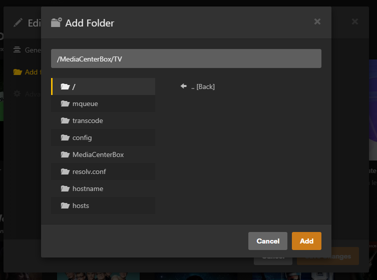


As you'll see later, these library directories will each have files automatically placed into them with Radarr (movies) and Sonarr (tv), respectively.

Now, Plex will then scan your files and gather extra content; it may take some time according to how large your directory is.

A few things I like to configure in the settings:

- Tick "Update my library automatically"

You can already watch your stuff through the Web UI. 

***


### Setup Sonarr

#### Sonarr Docker container

The docker file should look like this:

```yaml
  sonarr:
    container_name: sonarr
    image: 'linuxserver/sonarr:latest'
    restart: unless-stopped
    network_mode: host
    environment:
      - 'PUID=${PUID}'
      - 'PGID=${PGID}'
      - 'TZ=${TZ}'
    volumes:
      - '/etc/localtime:/etc/localtime:ro'
      - '${ROOT}/MediaCenter/config/sonarr:/config' #config Folder
      - '${HDDSTORAGE}:/MediaCenterBox' #data Folder
```

Then run the container with `docker-compose up -d --remove-orphans`.

To follow container logs, run `docker-compose logs -f sonarr`.

Sonarr web UI listens on port 8989 by default. You need to mount your tv shows directory (the one where everything will be nicely sorted and named). And your download folder, because Sonarr will look over there for completed downloads, then move them to the appropriate directory.

#### Sonarr Configuration

Sonarr should be available on `localhost:8989`. Go straight to the `Settings` tab.


Sonarr should be ready out of the box, there are multiple settings and configurations that you can explore later but we are going to start with the basics.

`Root Folders` is in the Media Management tab, here we add the `/MediaCenterBox/Completed/TV/` folder. This will be the default directory where all the TV Shows will be stored

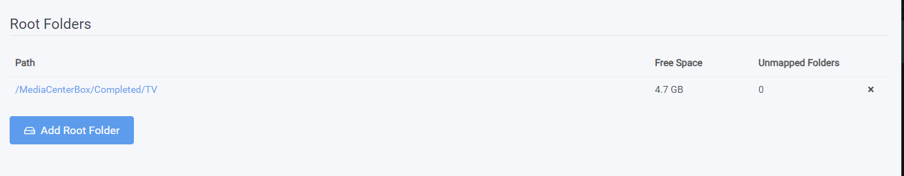

`Download Clients` tab is where we'll configure links with our tdownload client Deluge.
There are existing presets for these 2 that we'll fill with the proper configuration.

Deluge configuration:


Enable `Advanced Settings`, and tick `Remove Completed` in the Completed Download Handling section. This tells Sonarr to remove torrents from Deluge once processed.


`Indexers` is the important tab: that's where Sonarr will grab information about released episodes. This will be automatically configurated by [Prowlarr](#setup-prowlarr)


In `Connect` tab, we'll configure Sonarr to send notifications to Plex when a new episode is ready:


### Setup Radarr

Radarr is a fork of Sonarr, made for movies instead of TV shows. For a good while I've used CouchPotato for that exact purpose, but have not been really happy with the results. Radarr intends to be as good as Sonarr!

#### Radarr Docker container

Radarr is very similar to Sonarr.

```yaml

  radarr:
    container_name: radarr
    image: 'linuxserver/radarr:latest'
    restart: unless-stopped
    network_mode: host
    environment:
      - PUID=${PUID} # default user id, defined in .env
      - PGID=${PGID} # default group id, defined in .env
      - TZ=${TZ} # timezone, defined in .env
     volumes:
      - /etc/localtime:/etc/localtime:ro
      - ${ROOT}/config/radarr:/config # config files
      - ${ROOT}/complete/movies:/movies # movies folder
      - ${ROOT}/downloads:/downloads # download folder
```


Then run the container with `docker-compose up -d --remove-orphans`.

To follow container logs, run `docker-compose logs -f radarr`.

#### Radarr Configuration

Radarr should be available on `localhost:7878`. Go straight to the `Settings` tab.

Radarr should be ready out of the box, there are multiple settings and configurations that you can explore later but we are going to start with the basics.

`Root Folders` is in the Media Management tab, here we add the `/MediaCenterBox/Completed/Movies/` folder. This will be the default directory where all the TV Shows will be stored

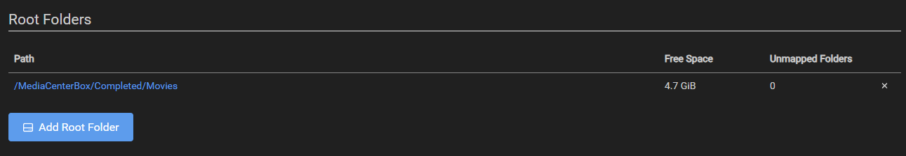

`Download Clients` tab is where we'll configure links with our download client Deluge.
There are existing presets for these 2 that we'll fill with the proper configuration.

Deluge configuration:


Enable `Advanced Settings`, and tick `Remove Completed` in the Completed Download Handling section. This tells Sonarr to remove torrents from Deluge once processed.


`Indexers` is the important tab: that's where Radarr will grab information about released episodes. This will be automatically configurated by [Prowlarr](#setup-prowlarr)


In `Connect` tab, we'll configure Sonarr to send notifications to Plex when a new episode is ready:

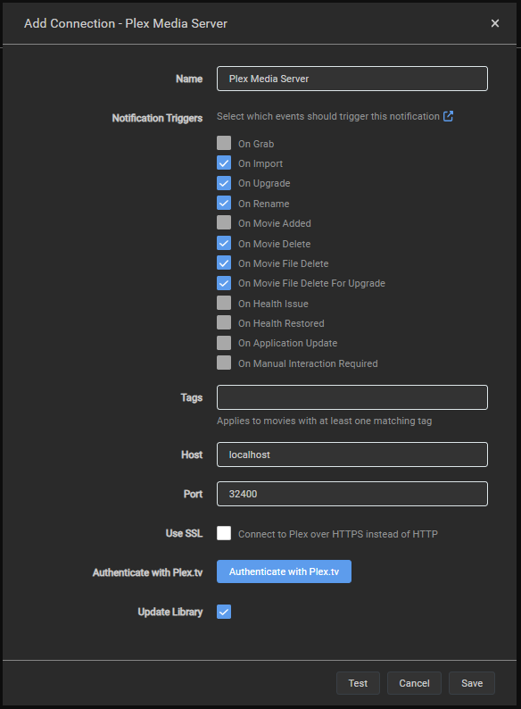


***
### Setup Prowlarr

[Prowlarr](https://prowlarr.com/) translates requests from Sonarr and Radarr to searches for torrents on popular torrent websites.

#### Prowlarr Docker container


```yaml
prowlarr:
    image: lscr.io/linuxserver/prowlarr:latest
    container_name: prowlarr
    environment:
      - PUID=1000
      - PGID=1000
      - 'TZ=${TZ}'
    volumes:
      - '${ROOT}/MediaCenter/config/prowlarr:/config'
    restart: unless-stopped
    #ports:
    #  - '9696:9696' #uncomment if you are not using the VPN
    network_mode: 'service:vpn' #comment/remove if you are not using the VPN
    depends_on:                 #comment/remove if you are not using the VPN
      - vpn                     #comment/remove if you are not using the VPN

```

Nothing particular in this configuration, it's pretty similar to other linuxserver.io images.

Then run the container with `docker-compose up -d --remove-orphans`.

To follow container logs, run `docker-compose logs -f prowlarr`.

#### Prowlarr Configuration

Prowlarr web UI is available on port 9696(`localhost:9696`, replace `localhost` by your machine ip if needed).


On login, it will request to set up a login method, anyone works, as an example i have used the forms option

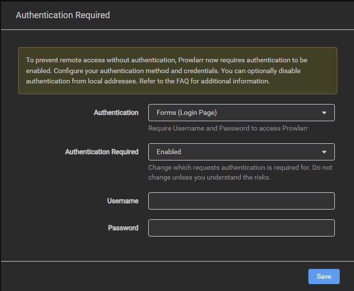


Click on `Add Indexer` and add any torrent indexer that you like. I added 1337x as an example.


Click on `Apps` and add the Sonarr and Radarr App, this will require an API key that you can get in the Radarr and Sonarr apps in the `Settings - General` and then `Security`


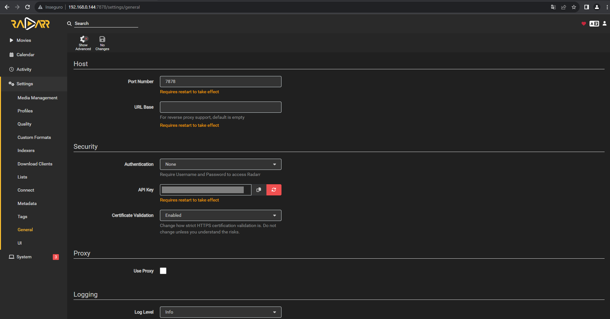

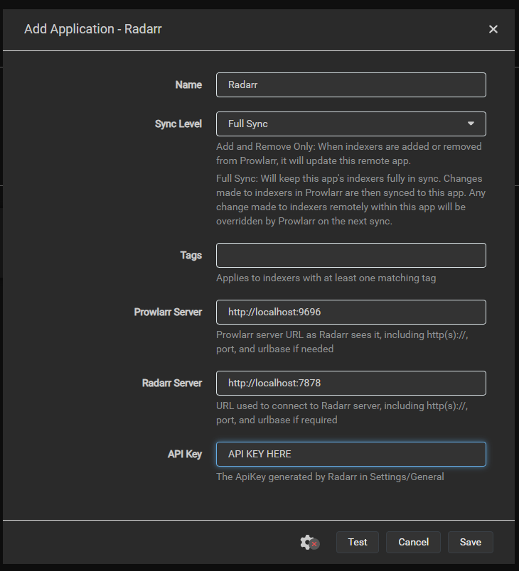


Do the Same for the Sonarr app and click on the `Sync App Indexers` button 


Now on Sonar and Radarr in the Settings - Indexers Tab it will show the indexer added in Prowlarr

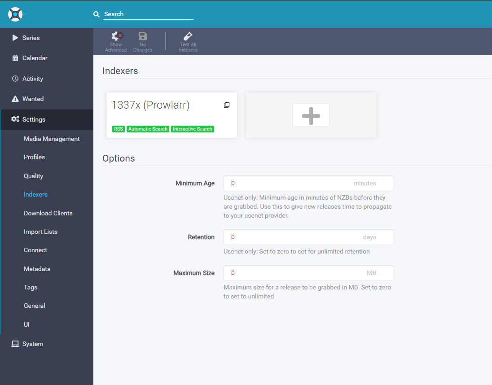


***


### Setup Bazarr

[Bazarr](https://www.bazarr.media/) hooks directly into Radarr and Sonarr and makes the process more effective and painless. If you don't care about subtitles go ahead and skip this step.

#### Bazarr Docker container

The docker file should look like this:


```yaml
  bazarr:
    container_name: bazarr
    image: 'linuxserver/bazarr:latest'
    restart: unless-stopped
    #network_mode: host
    environment:
      - 'PUID=${PUID}'
      - 'PGID=${PGID}'
      - 'TZ=${TZ}'
      - UMASK_SET=022
    volumes:
      - '${ROOT}/MediaCenter/config/bazarr:/config' # config files
      - '${HDDSTORAGE}:/MediaCenterBox' # Media folder
    ports:
      - '6767:6767'
  
```


Nothing particular in this configuration, it's pretty similar to other linuxserver.io images.

Then run the container with `docker-compose up -d --remove-orphans`.

To follow container logs, run `docker-compose logs -f bazarr`.


#### Bazarr Configuration

The Web UI for Bazarr will be available on port 6767. Load it up and you will be greeted with this setup page:

You can skip this page and go to the `Languages` tab. Here is an example I'm setting 2 languages to be fetch, English and Portuguese

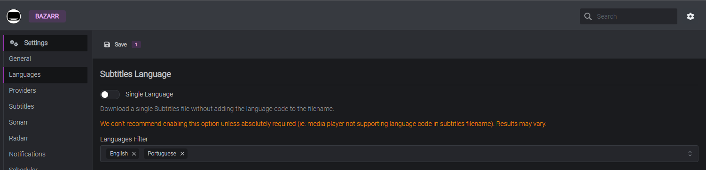

Now we are going to create a profile that will define the type of subtitles that we want.

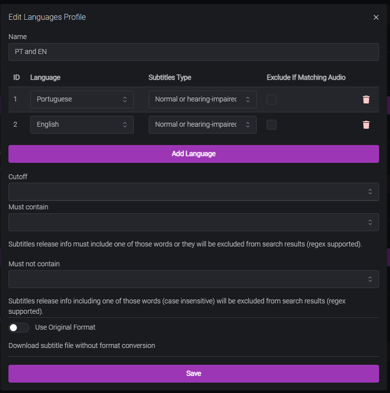

At last, we are going to set this profile as default for Movies and TV shows at the bottom of the page.

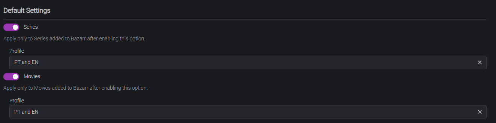

Hit Save on the top of the page and move to the next step.


Now go to the `Providers` tab. Here you can add all the providers that you choose from the provided list, for not I will use  [Open Subtitles](https://www.opensubtitles.org/). If you don't have an account head on over to the [Registration page](https://www.opensubtitles.org/en/newuser) and make a new account. 

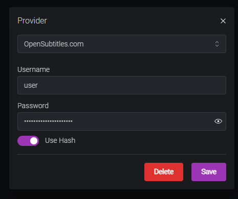

Hit Save on the top of the page and move to the next step.

Now we are going to enable the Sonarr and Radarr integrations. Go to the Sonarr tab and hit the enabled toggle.
Here we need to change the address to the `IP` otherwise Bazarr will not detect, change the IP address of your machine, in my example is the `192.168.0.144`, and set the Sonarr API key as we have done during the [Prowlarr configuration](#prowlarr-configuration) then hit test.


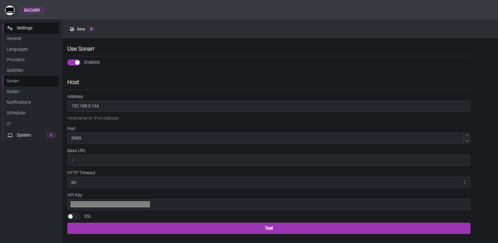

Hit Save on the top of the page and move to the Radarr Tab, do the same steps as above but using the Radarr API key, then hit Save on the top of the page and move to the next step.

After these steps you should see two new tabs, `Series` and `Movies`, this will be here where all the movies and tv shows are listed and the subtitles status of them. 

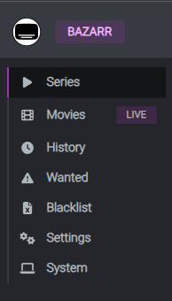

After this, all the required configurations are done and everything should work.


#### Testing

Go to Radarr to the `Movies` tab and click on `Add New`, search for a Movie, I'm going to use `The Last Man on Earth (1964)` as is a Public Domain Movie.
This will automatically fill in all the required information. You can adapt these parameters as you see fit. Make sure that you define a `Monitor` type so the movie is automatically downloaded

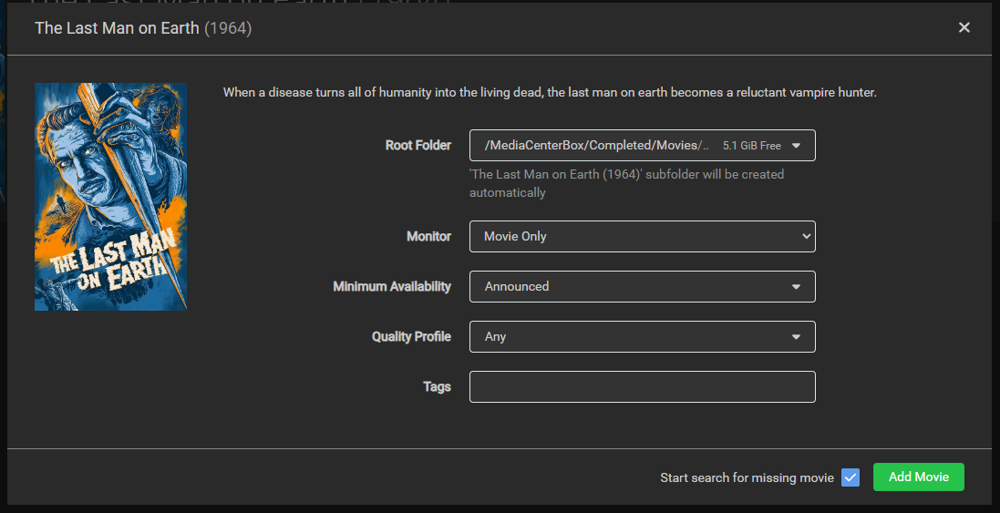

Now if you click on `Movies` tab the added movie will display with a colour showing the current status of it, and some seconds after it should automatically start to download.
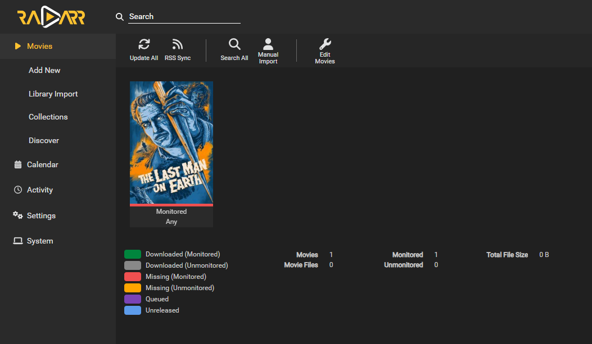

Is also possible to manually search and many other options but that is beyond the scope of this guide.


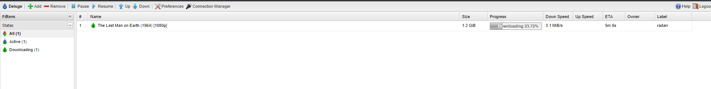


When the download is over, you can head over to Plex and check if the movie appeared correctly, with all metadata and subtitles grabbed automatically. 


#### Optional containers

The following containers are nice to have and are not required for the "mediaBox experience", they can be removed from the docker composed without any impact for all the system.


### Setup Wireguard
We'll use Wireguard Docker image from linuxserver [Docker image from linuxserver](https://hub.docker.com/r/linuxserver/wireguard )
This container will allow you to connect to all your services outside your home network exposing only one port


_Note_: It's required to open port 51820 in your router to be abbe to connect with the VPN to your home network.

The following website has some example of how to port forward for most of routers: [portforward.com](https://portforward.com/router.htm)


#### Wireguard Docker container

```yaml
wireguard:
  image: ghcr.io/linuxserver/wireguard:latest
  container_name: wireguard
  cap_add:
    - NET_ADMIN
    - SYS_MODULE
  environment:
    - PUID=${PUID} # default user id, defined in .env
    - PGID=${PUID} # default user id, defined in .env
    - TZ=${TZ} # timezone, defined in .env
    - SERVERURL=${SERVERURL} # server public ip, auto to auto find, defined in .env
    - SERVERPORT=51820 #optional
    - PEERS=${PEERS} # number of clients to be auto configured, defined in .env
    - PEERDNS=auto #optional
    - INTERNAL_SUBNET=172.168.69.0 #optional, network for devices ips. CAN NOT be the same as your home network
    - ALLOWEDIPS=0.0.0.0/0 #optional
  volumes:
    - ${ROOT}/MediaCenter/config/wireguard:/config # config folder
    - /lib/modules:/lib/modules
  ports:
    - 51820:51820/udp
  sysctls:
    - net.ipv4.conf.all.src_valid_mark=1
  restart: always


```

Nothing particular in this configuration, it's pretty similar to other linuxserver.io images.

Then run the container with `docker-compose up -d --remove-orphans`.

To follow container logs, run `docker-compose logs -f wireguard`.


#### Wireguard Configuration


All the user's credentials will be created inside the config folder for wireguard ${ROOT}/MediaCenter/config/wireguard/peerX where peerX will be peer1, 2, 3,...


***


## Overseerr Setup

We'll use Overseerr [official Docker image](https://hub.docker.com/r/sctx/overseerr)
Overseerr is a request management and media discovery tool built to work with your existing Plex ecosystem.
Overseerr helps you find media you want to watch. With inline recommendations and suggestions.

It will allow you to request Movies and TV Shows without the need to go to Radarr or Sonarr, this is really helpful when there are other users in the system that we do not want to give access to Sonarr or Radarr for them to request movies or tv shows.

### Overseerr Docker Container


```yaml
  overseerr:
    image: sctx/overseerr:latest
    container_name: overseerr
    environment:
      - LOG_LEVEL=debug
      - TZ=${TZ}
    ports:
      - 5055:5055
    volumes:
      - ${ROOT}/MediaCenter/config/overseerr/config:/app/config
    restart: unless-stopped
```


Then run the container with `docker-compose up -d --remove-orphans`.

To follow container logs, run `docker-compose logs -f overseerr`.


#### Overseerr Configuration

The Web UI for Overseerr will be available on port 5055. Load it up and you will be greeted with this setup page:

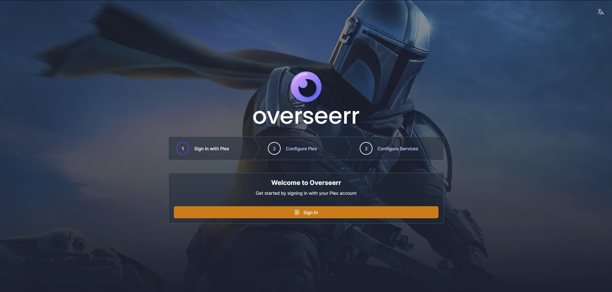

You will need to log in with your Plex account.

In the following screen fill the requested information

Server: Manual Configuration
Hostname or IP Address: your Plex Docker container IP
Port: your Plex Docker container port

Select the Libraries that you want to scan and hit Start Scan

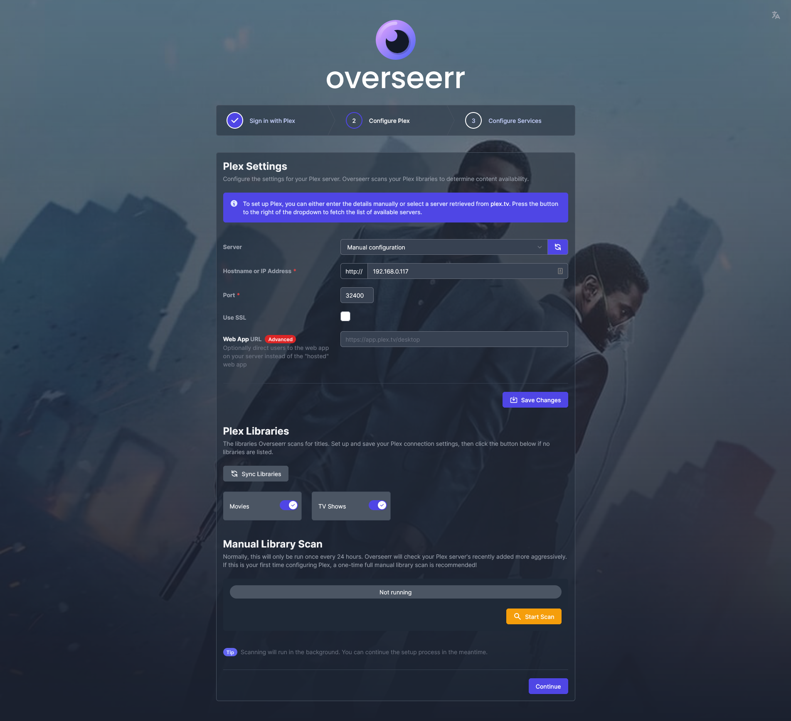


Radarr and Sonarr Setup
in the following screen configure the both Radarr and Sonarr

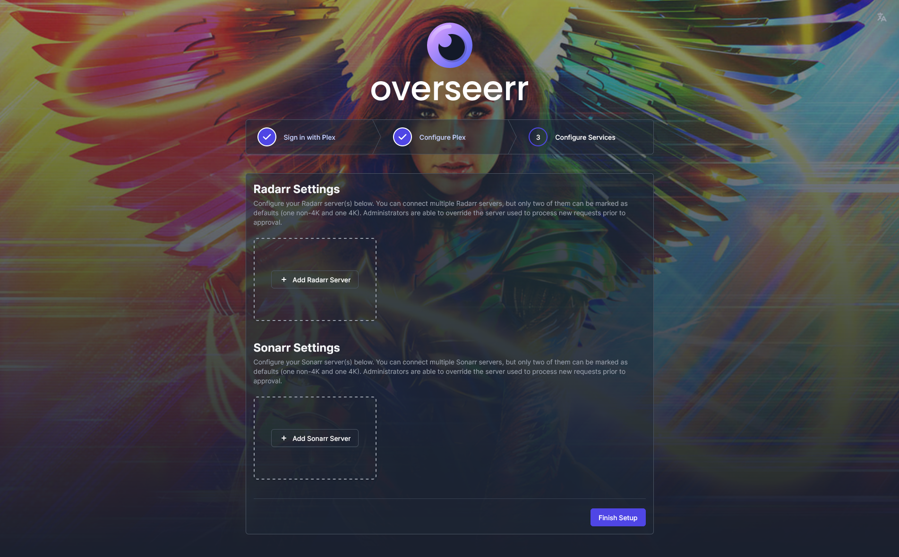

for each, we need to define it as the default server set the IP address (the port should be the default one) and the API Key, then click on test.
after that fill the remaining settings with your desired configuration.


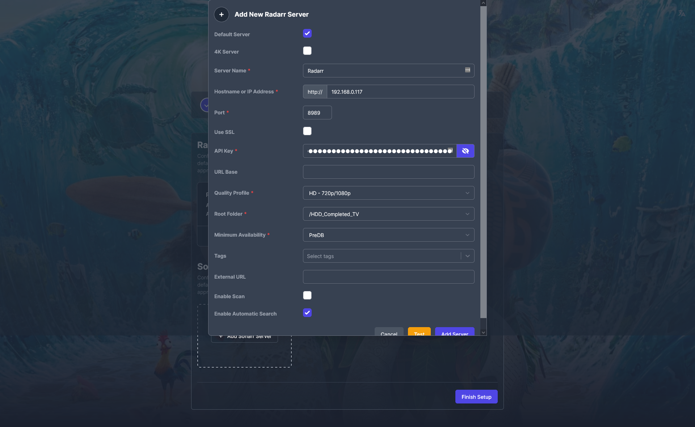

#### Portainer Setup

We are going to use the official [Portainer Community Edition](https://github.com/portainer/portainer) image, this is a lightweight service that allows us to monitor all of our containers, we can see the status, logs and manage them directly there.
It will require registration on the Portainer website to get a free license.


#### Portainer Docker Container


```sh
docker volume create portainer_data

docker run -d -p 8000:8000 -p 9444:9443 -p 9000:9000 --name portainer --restart=always -v /var/run/docker.sock:/var/run/docker.sock -v portainer_data:/data portainer/portainer-ee:latest
```


### Portainer Configuration


The Web UI for Portainer will be available on port 9000. Load it up and you will be greeted with the admin creation page.
Add an username and password and hit `Create User`

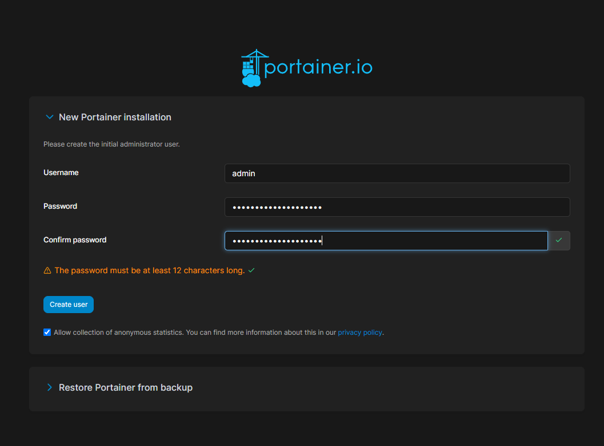

On the next page click on `Don't have a license?` and request a free one and insert it here and click on submit.

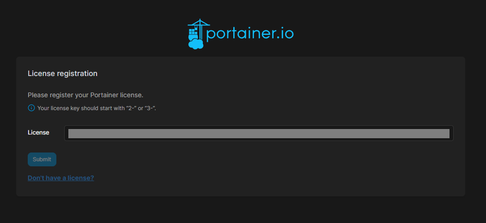

Here just click on `Get Started` and you will be redirected to the `Environments` page.
Select your environment click on `Stack` and then on the `quick-arr-stack`.
On this page, you can see all your containers for this stack and multiple options to manage them.

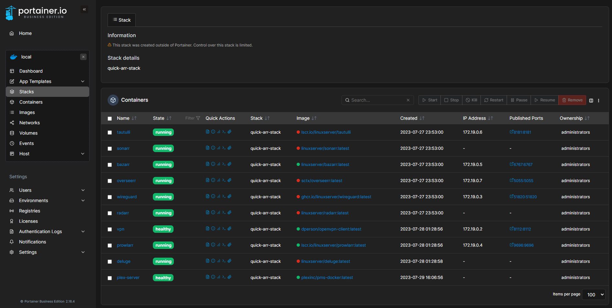


## Media Management Script

[arr-stack-manager](https://github.com/Rick45/arr-Stack-Manager), a small script that delete watched data after X days

## Mobile Management

[Lunsea](https://www.lunasea.app/), Open source manager

[nzb360](http://nzb360.com), is more powerful than lunasea  with a free and paid version. 

_Note_: This only work inside your home network.


## Thanks
[](https://www.buymeacoffee.com/rick45)

## Star History

[](https://www.star-history.com/#Rick45/quick-arr-Stack&Date)
